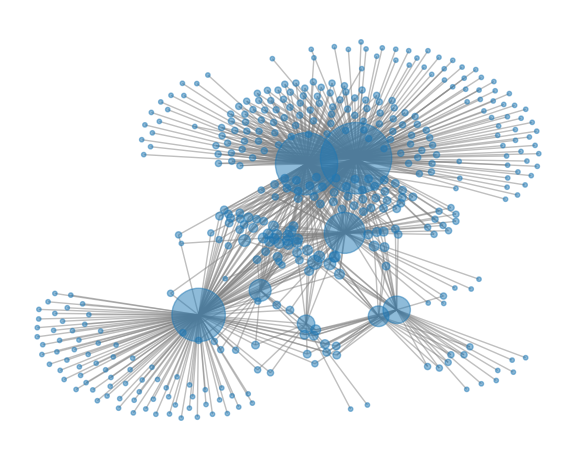
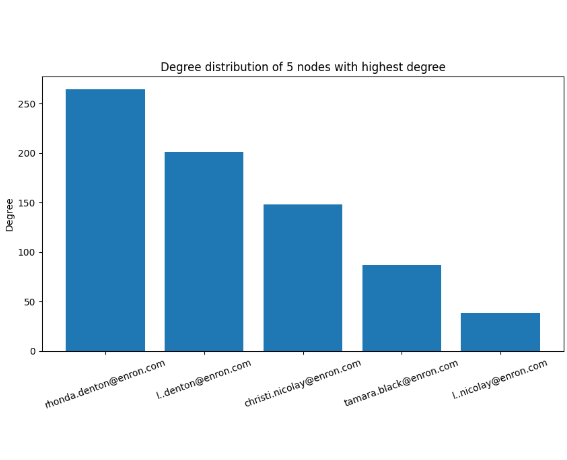
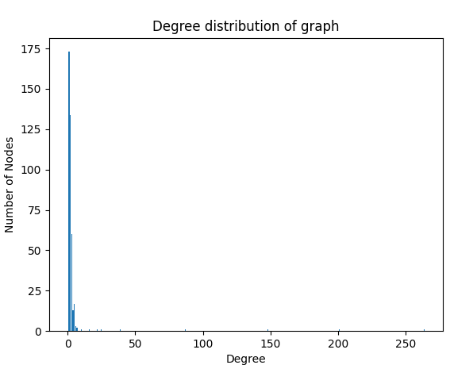

# 1. Задача по Вовед во мрежна наука

### Податочно множество
Подмножество од [Enron корпусот](https://snap.stanford.edu/data/email-Enron.html) (фолдерот `baughman-d/power/legal_agreements`), што содржи
некои од разменетите email пораки помеѓу вработените во фирмата. Секој јазол претставува email адреса на вработен, а секое ребро е порака (во било која насока).

### Својства

 \
Интересна забелешка е тоа што степените на петте најголеми хабови приближно следат аритметичка
прогресија со разлика 50. \

 \
Коефициент на кластерирање: 0.122, просечно растојание: 2.457, густина: 0.009

Според графикот со две логаритамски оски, изгледа дека распределбата на степените следи степенов закон т.е. дека мрежата е без размер. Ова се гледа и од цртежот (повеќето од јазлите
се слабо поврзани).
